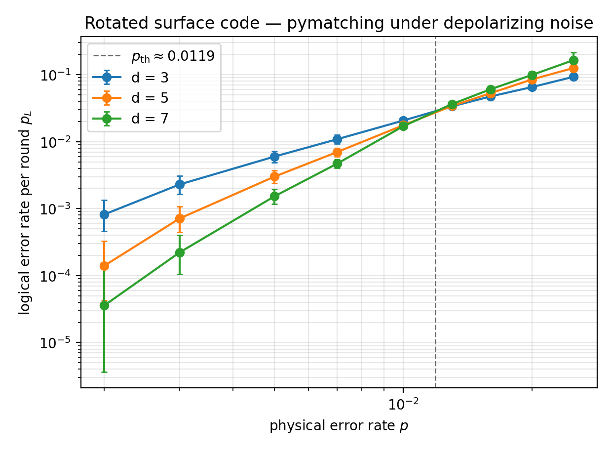

# QEC-Project

[](https://github.com/TirtheshJani/QEC-Project/actions/workflows/ci.yml)

Self-study quantum error correction (QEC) curriculum + decoder-focused
capstone, structured to ground an Expression of Interest to the National
Research Council of Canada's
[Applied Quantum Computing Challenge](https://nrc.canada.ca/en/research-development/research-collaboration/research-centres/emerging-directions-fault-tolerant-quantum-computing-call-proposals)
(QEC stream).

The intent is not to read about QEC — it is to *build* enough of it that
the capstone preprint is a credible artifact behind an EOI conversation.

## Mission

Take a true beginner (math + QM from scratch) through 5 curriculum phases
and into a focused decoder benchmark study on the rotated surface code,
targeting NRC's *Decoding algorithm optimization* objective. Budget:
~4–6 months at 20+ hrs/week.

## Curriculum index

| Phase | Topic | Duration |
| --- | --- | --- |
| [Phase 0](phase-00-foundations/) | Linear algebra, probability, classical error correction | ~3 wks |
| [Phase 1](phase-01-quantum-basics/) | Qubits, gates, entanglement, noise channels (Qiskit) | ~3 wks |
| [Phase 2](phase-02-qec-fundamentals/) | Stabilizer formalism, Steane, intro to Stim | ~4 wks |
| [Phase 3](phase-03-topological-codes/) | Surface code, MWPM/PyMatching, thresholds | ~4 wks |
| [Phase 4](phase-04-fault-tolerance/) | FT syndrome extraction, magic states, lattice surgery | ~3 wks |
| [Phase 5](phase-05-advanced-decoders/) | BP+OSD, Union-Find, neural decoders, qLDPC | ~4 wks |
| [Capstone](capstone/) | Decoder benchmark study + arXiv preprint + mock EOI | ~6–8 wks |

**Status:** Phases 0, 1 and 3 complete (foundations → a runnable surface-code decoder
benchmark). Phase 2 is partly done: 2.1 (3-qubit repetition code) and 2.2 (Shor 9)
are in; 2.3 to 2.5 (stabilizer formalism, Steane, intro to Stim) are not started.
Phases 4–5 + the written EOI are the roadmap.

## Results so far — the capstone decoder benchmark

The capstone payload **runs end to end**: a reproducible rotated-surface-code
threshold study comparing **MWPM (PyMatching)** and **BP+OSD (ldpc)** under uniform
circuit-level depolarizing noise, built on Stim with an in-process, explicitly
seeded Monte-Carlo harness.



*MWPM, per-round logical error rate at $d = 3, 5, 7$ (committed 2026-06-19 sweep). The
dashed line is the curve-crossing estimate ($p \approx 0.0119$), not the fitted
$p_\mathrm{th}$ in the table. Error bars are sinter likelihood-ratio intervals: the rates
whose likelihood is within a factor of 1000 of the best fit (`max_likelihood_factor=1000`).*

| Decoder | fitted $p_\mathrm{th}$ (per round) | distances in the fit | wall time per shot, Stim sampling + decoding (batched), $d=3$ / $d=5$ |
| --- | --- | --- | --- |
| MWPM (PyMatching) | $0.0122 \pm 0.0013$ | 3, 5, 7 | 2.1 / 9.1 µs |
| BP+OSD (ldpc)     | $0.0134 \pm 0.0015$ | 3, 5 | 123 / 5369 µs (58× / 587× MWPM) |

The two fitted thresholds overlap within fit error, so this data does not rank the
decoders by threshold. BP+OSD's measured edge is lower $p_L$ at $d=5$ (35% lower at
$p=0.005$). That difference is significant (two-proportion $z > 2$) only for
$p = 0.005$ to $0.02$, and the two decoders saw independently sampled shots, so the
comparison is unpaired. BP+OSD pays for it with a time per shot 58× MWPM's at $d=3$
and 587× at $d=5$: the accuracy vs real-time-feasibility frontier the capstone targets
(NRC *Decoding algorithm optimization*).

Sub-threshold suppression at $p = 0.005$, where each cell holds 192 to 355 logical
errors: $\Lambda_{3\to5} = p_L(3)/p_L(5)$ is 1.99 (95% interval 1.71 to 2.33) for MWPM
and 2.72 (2.27 to 3.25) for BP+OSD (the two intervals overlap), and MWPM's
$\Lambda_{5\to7}$ is 1.97 (1.65 to 2.35).
The intervals come from a seeded parametric bootstrap on the binomial counts:
`uv run python scripts/lambda_interval.py capstone/experiments/sweep-2026-06-19-*/stats.csv --p 0.005`.
The fresh rerun described below gives $\Lambda_{3\to5}$ of 1.97 and 2.70 at this $p$.
$\Lambda$ at the lowest swept $p = 0.002$ is not reported: those cells hold 5 to 49
errors, and the same rerun moves $\Lambda_{3\to5}$ there from 5.8 and 6.3 to 4.2 and 10.6.

The committed 2026-06-19 data was sampled with per-process seeds (see
[`capstone/experiments/README.md`](capstone/experiments/README.md)). A fresh run of the
documented commands, deterministic since f5a48b3, gives $p_\mathrm{th} = 0.0123 \pm 0.0012$
(MWPM) and $0.0145 \pm 0.0016$ (BP+OSD), consistent with the table within fit error.
Every number is seed- and commit-stamped in [`CHANGELOG.md`](CHANGELOG.md).

How the numbers are measured: $p_\mathrm{th}$ is a fit of
$p_L = A\,(p/p_\mathrm{th})^{(d+1)/2}$ to per-round logical error rates over the whole
$p$ grid (the per-shot curves cross lower, near $p = 0.007$). BP+OSD is fitted on
$d = 3, 5$ and MWPM on $d = 3, 5, 7$. The fit window is a systematic: restricting it to
$p \le 0.01$ moves MWPM to $0.0101 \pm 0.0005$ and BP+OSD to $0.0122 \pm 0.0013$. Time
per shot is wall-clock time for Stim sampling plus decoding, summed over the $p$ grid at
each distance and divided by the number of shots, with cells running in parallel worker
processes. BP+OSD is ldpc's `SinterBpOsdDecoder` (min-sum BP with `max_iter=20`, OSD-CS
of order 7), driven through its file-based sinter interface, which rebuilds the decoder
for every batch and decodes shot by shot in Python. It is a same-harness comparison,
not a tuned decoder-only latency benchmark, and it depends on machine load: the fresh
rerun above measured 7.2 and 5236 µs per shot at $d=5$.

## Quickstart

```bash
# 1. Install Python deps via uv (https://docs.astral.sh/uv/); Python 3.12
uv sync --extra dev

# 2. Sanity check (the same steps CI runs)
uv run pytest -q
uv run ruff check .
uv run mypy src/qec_project
uv run python scripts/verify_reading_list.py

# 3. Regenerate the capstone figures + summary.json from the committed sweep data
uv run python scripts/make_figures.py capstone/experiments/sweep-2026-06-19-*/stats.csv --noise depolarizing

# 4. Start
uv run jupyter lab phase-00-foundations/
```

`uv run pytest -m slow` runs the Monte-Carlo physics tests, which are deselected by
default. Step 3 rewrites `capstone/figures/` with files byte-identical to the committed
ones, so `git status` stays clean.

Optional, only for working on the repo with Claude Code (not needed to run anything
above): `bash scripts/install_plugins.sh` installs the three plugins described below.

## How this repo is governed

Three plugins + one cross-session memory pattern:

- **[Superpowers](https://github.com/obra/superpowers)** — engineering
  methodology (TDD, plans, code review, parallel agents,
  verification-before-completion). Governs everything under
  `src/qec_project/`, `tests/`, `scripts/`, and `capstone/experiments/`.
  See `docs/superpowers-cheatsheet.md`.
- **[Academic Research Skills (ARS)](https://github.com/Imbad0202/academic-research-skills)**
  (CC-BY-NC 4.0) — paper/EOI workflow with anti-hallucination integrity
  gates. Governs `capstone/proposal/`, `capstone/paper/`, and
  `docs/reading-list.md`. See `docs/ars-cheatsheet.md`.
- **[Scientific Agent Skills](https://github.com/K-Dense-AI/scientific-agent-skills)**
  (MIT) — domain catalog. We pull a focused ~10-skill subset; see
  `docs/sciskills-active.md`. The rest stay dormant.
- **[Long-running Claude pattern](https://www.anthropic.com/research/long-running-Claude)**
  — `CHANGELOG.md` is the project's portable long-term memory across
  sessions. Read at session start; write at session end. See
  `docs/long-running-protocol.md`.

Nothing from the three plugins is vendored — they are installed by
reference. `CLAUDE.md` is the single source of truth for how Claude Code
sessions should operate inside this repo.

## Stack

Python 3.12, managed by `uv`. Core: Stim, PyMatching, Sinter, ldpc, Qiskit,
NumPy, SciPy, Matplotlib, NetworkX. Dev: pytest + hypothesis, ruff, mypy,
JupyterLab. Optional ML extras: torch + lightning + scikit-learn + SHAP + PyMC.
Optional remote: `modal` for cloud burst on large sweeps.

## License

The `LICENSE` in this repo (MIT) covers code we author. The three plugins
above retain their own licenses upstream — none of their files are copied
into this repo.
